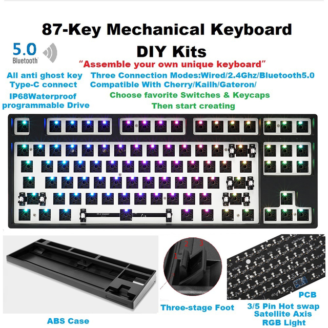

# Unknown Chiness K87

Unknown K87
chinese unknown brand k87 gaming keyboard

Keyboard Maintainer: [Lexia Lim](https://github.com/wwwhana)
Based on Kemove DK63 by: [Stephen Peery](https://github.com/smp4488)
Hardware Supported: SN32F248BF

Make example for this keyboard (after setting up your build environment):

    make evision/k87:wwwhana

See the [build environment setup](https://docs.qmk.fm/#/getting_started_build_tools) and the [make instructions](https://docs.qmk.fm/#/getting_started_make_guide) for more information. Brand new to QMK? Start with our [Complete Newbs Guide](https://docs.qmk.fm/#/newbs).

## Required
 * [SonixQMK](https://github.com/SonixQMK/qmk_firmware)
 * tested commit a46e96cdd01cffc32d369c9317808799166f1ace

## device info
 * VENDOR ID `0x320F`
 * PRODUCT ID `0x504C`
 * NO Bluetooth, No 2.4Ghz, Only USB C connect
 * Black or White shell
 * written on board `NK100-HC-VS V1 20201221`
 * no reset button. required boot pin short with gnd 
 * like under thumbnail

